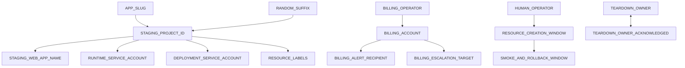

# Trusted Functions Staging Resource Preflight

Status: local-only, proposal-only, and non-operational. Every formal approval
remains `undecided`. Completing this checklist does not authorize an operation.

## Boundary

This package validates private identifiers and approval metadata immediately
before a separately approved staging-resource creation window. It cannot call
Firebase, Google Cloud, a network service, `gcloud`, `firebase`, or a shell. It
cannot create projects, attach billing, configure IAM or App Check, deploy
rules or Functions, create fixtures, enable gates, or read or write staging or
production.

Secrets and credentials are out of scope. Do not place passwords, access or
debug tokens, service-account keys, private keys, application-default
credentials, or other authentication material in the preflight file.

The data classes are:

- **Private identifier:** billing references, operator identities, notification
  destinations, teardown responsibility, and pre-creation resource names.
- **Secret or credential:** authentication material; never collected here.
- **Public configuration:** locations, labels, and resource names that may
  become visible after creation.
- **Approval metadata:** bounded windows and acknowledgments; input completion
  remains separate from formal approval.

## Storage And Output

The tracked placeholder is:

`functions/staging/staging-resource-inputs.example.json`

Real values may exist only in:

`functions/.local/staging-resource-inputs.json`

The entire `functions/.local/` directory is git-ignored. The CLI creates the
directory as mode `0700` and the file as mode `0600`, refuses alternate paths,
refuses to overwrite an existing file, and rejects a non-regular, symlinked, or
group/world-accessible input. Private values must not be committed, logged,
screenshotted, pasted into chat, or copied into public documentation.

Normal output reports only completion booleans, format validity, aggregate
dependency counts, approval states, status, and zero operation counters. It
never prints field values or the private file path.

## Input Contract

| Field | Format and classification | Dependencies and use approval |
| --- | --- | --- |
| `APP_SLUG` | Lowercase ASCII letters, digits, and single hyphens; starts with a letter; no trailing/consecutive hyphens; 3-15 characters; public configuration. Avoid personal names, trademarks, and production-like wording. Placeholder examples: `<APP_SLUG>`, `sample-app`. | Required before project and service-account names; staging resource creation. |
| `RANDOM_SUFFIX` | Exactly eight lowercase letters or digits generated locally from a cryptographically secure random source; private before creation. Never use timestamps, initials, birthdays, phone numbers, personal data, or a production suffix. | Generate only after explicit resource-creation approval; depends on `APP_SLUG`. |
| `STAGING_PROJECT_ID` | Exact `<APP_SLUG>-staging-<RANDOM_SUFFIX>` composition; Google project ID syntax, 6-30 characters, literal `staging`, no `prod`, `production`, or `live`; public after creation. | Depends on slug and suffix; availability check and creation require separate approval. |
| `BILLING_ACCOUNT` | Private `billingAccounts/NNNNNN-NNNNNN-NNNNNN` identifier; not a credential. | Depends on an authorized `BILLING_OPERATOR`; billing attachment approval. |
| `BILLING_OPERATOR` | Private selected operator reference; presence and format only. | Access verification and billing action require separate approval. |
| `STAGING_WEB_APP_NAME` | 4-40 characters, visibly contains `Staging`, no URL or secret; semi-public. | Depends on project ID; web-app registration approval. |
| `RUNTIME_SERVICE_ACCOUNT` | 6-30 lowercase letters, digits, and hyphens, ending `-runtime-stg`; public after creation. Pattern: `<APP_SLUG>-trusted-runtime-stg` where the completed ID remains within 30 characters. | Depends on slug and project ID; identity creation and IAM approvals. |
| `DEPLOYMENT_SERVICE_ACCOUNT` | 6-30 lowercase letters, digits, and hyphens, ending `-deployer-stg`; public after creation. Pattern: `<APP_SLUG>-trusted-deployer-stg` where the completed ID remains within 30 characters. | Depends on slug and project ID; identity creation and IAM approvals. |
| `RULES_OPERATOR_IDENTITY` | Private selected identity; may match the human operator. | Resource window and separate rules-operator access approval. |
| `HUMAN_OPERATOR` | Private selected identity. Reviewer and operator responsibilities remain separately recorded even when the same person performs both. This is not independent two-person review. | Required before the resource window and resource-creation approval. |
| `BILLING_ALERT_RECIPIENT` | Private notification destination. Output reveals only configured true/false. | Billing account; budget and alert approval. |
| `BILLING_ESCALATION_TARGET` | Private escalation destination; may initially match the recipient. | Billing account; budget and alert approval. |
| `RESOURCE_LABELS` | Google Cloud label syntax, no sensitive values. Mandatory: `environment=staging`, `data_classification=synthetic`, `managed_by=manual-reviewed`, `lifecycle=temporary`, `application=trainer-hub`. | Project ID; resource-creation approval. |
| `RESOURCE_CREATION_WINDOW` | ISO-8601 `startAt` and `expiresAt` with timezone; expiration after start; maximum four hours; must be unexpired. | Human operator; resource-creation approval. |
| `SMOKE_AND_ROLLBACK_WINDOW` | ISO-8601 bounded window with timezone; maximum 24 hours; must be unexpired. | Resource-creation window; later deployment and smoke approvals. |
| `TEARDOWN_OWNER` | Private named responsibility. | Teardown acknowledgment and resource-creation approval. |
| `TEARDOWN_OWNER_ACKNOWLEDGED` | Boolean `true`, recorded privately. | Teardown owner must accept the complete cleanup checklist. |

Google Cloud currently documents project IDs and service-account IDs as 6-30
lowercase letters, digits, and hyphens. Project IDs must start with a letter and
cannot end with a hyphen. Reverify these limits from official documentation
immediately before resource creation because provider constraints can change.

Eight random characters provide a materially lower collision probability than
six while keeping the 30-character project-ID budget practical. This package
does not expose a generator. Generate the value from a local CSPRNG only inside
the separately approved creation window.

## Production-Similarity Rejection

The validator applies NFKC normalization, lowercase folding, and removal of
non-alphanumeric separators. It rejects:

1. exact equality with the known production project ID;
2. a candidate containing the complete normalized production identifier;
3. a candidate within Levenshtein distance two of production;
4. any candidate lacking the literal `-staging-` marker; or
5. any candidate containing `prod`, `production`, or `live` as a segment.

Availability is not checked locally. No project may be created merely to test
name availability. That check belongs inside an explicitly approved creation
window.

## Dependencies



Validation fails closed when configured fields have missing dependencies.
`RTDB_LOCATION=us-central1` and `FUNCTIONS_REGION=us-central1` are already
proposed values, not approvals.

## Formalized Group A-C Recommendations

These are non-secret proposed values. They are stored separately from the
private input document and do not complete a field, change an approval, or
invoke an operation.

- `APP_SLUG=trainer-hub`
- `RANDOM_SUFFIX=<unresolved 8-character CSPRNG value>`
- `STAGING_PROJECT_ID=trainer-hub-staging-<RANDOM_SUFFIX>` (28 characters
  after suffix generation)
- `STAGING_WEB_APP_NAME=Trainer Hub Staging`
- `RUNTIME_SERVICE_ACCOUNT=trainer-hub-runtime-stg`
- `DEPLOYMENT_SERVICE_ACCOUNT=trainer-hub-deployer-stg`
- Labels: `environment=staging`, `data_classification=synthetic`,
  `managed_by=manual-reviewed`, `lifecycle=temporary`, and
  `application=trainer-hub`.

The same private person may initially hold `BILLING_OPERATOR`,
`RULES_OPERATOR_IDENTITY`, `HUMAN_OPERATOR`, `BILLING_ALERT_RECIPIENT`,
`BILLING_ESCALATION_TARGET`, and `TEARDOWN_OWNER`. The duties retain separate
checklists, timestamps, access windows, and acknowledgments. This is explicitly
not independent two-person review. No concrete identity or contact destination
is tracked.

- `BILLING_ACCOUNT=<PRIVATE_BILLING_ACCOUNT>`
- `RESOURCE_CREATION_WINDOW_DURATION=2 hours`
- `SMOKE_AND_ROLLBACK_WINDOW_DURATION=2 hours`
- `RESOURCE_CREATION_WINDOW=<UNRESOLVED>`
- `SMOKE_AND_ROLLBACK_WINDOW=<UNRESOLVED>`

The suffix, billing identifier, and actual dates remain unresolved. The suffix
may be generated locally from a CSPRNG only after explicit resource-creation
approval. Availability and production-similarity checks occur in that same
future preflight window.

## Dependency Order

1. Complete and locally validate all private preflight fields.
2. Reverify current official pricing.
3. Record explicit resource-creation approval and its two-hour window.
4. Attach the privately selected billing account and establish budget/alerts.
5. Create only the approved empty staging resources.
6. Verify the complete resource inventory and stop.
7. Close the resource-creation window and remove temporary access where applicable.
8. Obtain separate approval for additive staging rules.
9. Obtain separate approval for Functions deployment.
10. Obtain separate approvals for App Check, fixtures, each gate, canaries, and client wiring.
11. Open a distinct two-hour smoke-and-rollback window for every deployment.
12. Revoke temporary operator permissions when the window closes.

## Window Recommendations

- Resource creation: two hours normally, with a hard maximum of four hours.
- Deployment and smoke: two hours for the initial staging deployments.
- Emergency rollback access: retain through the same bounded smoke window,
  never longer than 24 hours without fresh review.
- Begin no operation before `startAt`. Expiration procedurally cancels approval
  and requires a fresh review. Revoke temporary IAM after formal closure.
- This package creates no scheduler, reminder, automation, or IAM binding.

## Local Commands

From the repository root:

```bash
npm run staging:resource-preflight -- create-template
npm run staging:resource-preflight -- validate
npm run staging:resource-preflight -- summary
```

`create-template` creates only the ignored mode-0600 placeholder. `validate`
checks local formats and dependencies. `summary` emits the smaller redacted
aggregate. None accepts a target, credential, approval, network option, or
operation flag.

## Existing Proposed State

- `RTDB_LOCATION=us-central1`
- `FUNCTIONS_REGION=us-central1`
- `BUDGET_AMOUNT=USD 10/month`
- `MANUAL_INVESTIGATION_THRESHOLD=USD 3-5/month`
- Actual alerts: USD 1, 2.50, 3, 5, 7.50, 9, and 10.
- Forecast alerts: 50%, 75%, and 100%.
- Fixture ownership ledger: `stagingFixtureRuns/{fixtureRunId}`.
- Rollback rules SHA: `e0632a98ed106117f03e61da0446ef4b2c2e6ed02ea8c6f1c498a0e7edcb17bf`.
- Additive rules SHA: `ba0816f465b4830a726881fc6a00c3805283b8d4c77d80ed8daebc026719b45a`.

All 11 execution approvals remain separate and `undecided`. Private-input
completion does not approve resource creation, billing attachment, rules,
Functions, App Check, fixtures, gates, canaries, client wiring, migration,
grants, cohort selection, or production activity.

## Teardown Responsibility

The private teardown owner must acknowledge responsibility for verifying the
removal or closure of Functions, synthetic RTDB and Auth fixtures, App Check
configuration and debug tokens, service accounts and IAM bindings, Artifact
Registry images, Cloud Build artifacts, logs and sinks, monitoring and alerts,
budgets, the staging web app and project, and billing linkage. This package
records only the private acknowledgment and performs no teardown.
