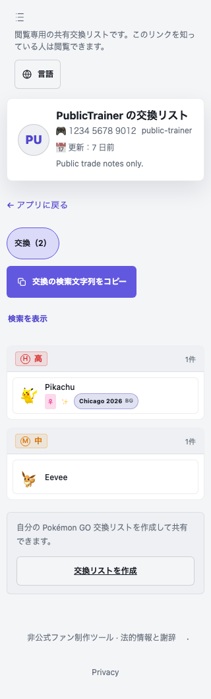
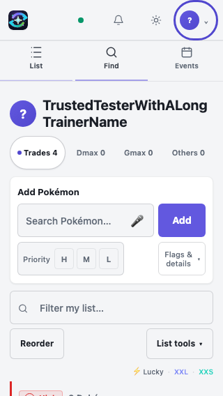
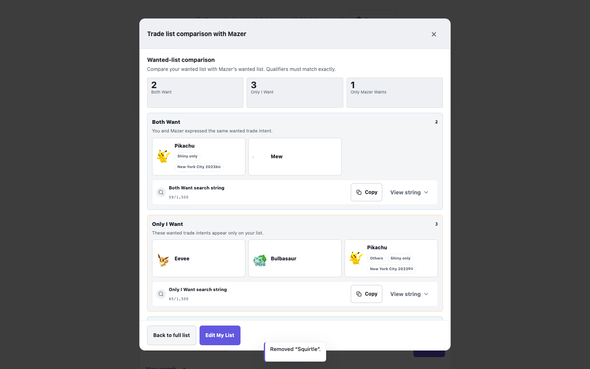
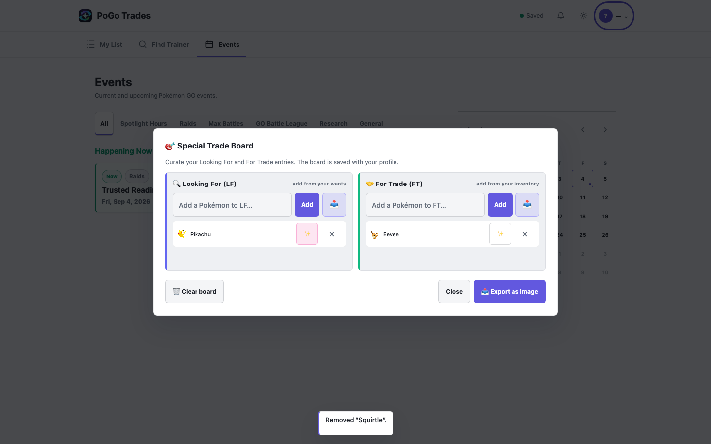

# Visual Evidence

All images committed here are synthetic local fixtures, not private production records. Public-page sprites are mocked shapes in these tests: use those images for hierarchy, locale and control geometry, not sprite-art quality. Authenticated fixture images are useful for structure; identity state and writes are simulated.

## Recipient: New Search Action

Category-specific copying appears immediately below the category tabs. Japanese wraps at 320 px without document overflow; the English Pokemon names and background label are a recorded remaining localization problem.



[Spanish 390 px](evidence/public-390-es.png) | [German 430 px](evidence/public-430-de.png) | [English desktop](evidence/public-1440-en.png)

## My List: First-Viewport Cost

The long fixture trainer name wraps rather than escaping. The Add/filter/tools stack still consumes substantial height before rows. The production empty-account banner adds more height, so a compact empty-state proposal remains useful.



## Discovery: Scope and Navigation

[Trainers, 390 px](evidence/trusted-trainers-390x844.png) and [Find by Pokemon, 430 px](evidence/trusted-find-pokemon-430x932.png) show the separate discovery modes. A proposed integrated scope selector should replace ambiguity, not broaden read permissions.

## Compare: Wants Are Not Offers



Keep these honest labels unless explicit For Trade data exists. Neither “Only They Want” nor “Both Want” proves anyone owns a matching Pokemon.

## Board and Settings



The saved image board is useful, but the editor's “add from your inventory” wording exposes the old concept. The proposal is to make Board an export view, not resurrect quantities or mirror controls.

[Account & Security, 390 px](evidence/trusted-settings-390x844.png) shows the full-height form and substantial vertical space. No production account was edited.

## Production and Reference Evidence

Local-only evidence directory: sibling `product-audit-evidence/` beside the audit worktree.

- `production-mylist-320.png`: empty-state/header pressure.
- `production-profile-320.png` and `production-profile-desktop.png`: settings profile.
- `production-public-desktop.png`: anonymous page before search restoration.
- `production-compare-desktop.png`: real wanted-only comparison.
- `production-events-desktop.png`: calendar/feed hierarchy.
- `competitor-9db.png` and `competitor-leekduck.png`: reference UI inspection, not licensed app assets.

No screenshots were altered to claim a pass. The attempted in-app 390 px public capture had an unreliable viewport shape and was excluded; deterministic local captures provide the phone-width evidence.

## Reproduce Local Evidence

Start the isolated branch's local server. Set `PLAYWRIGHT_BASE_URL` to its URL so Playwright cannot accidentally reuse another worktree's server. Set `PRODUCT_AUDIT_SCREENSHOT_DIR` and `TRUSTED_READINESS_SCREENSHOT_DIR` to an absolute writable output directory, then run:

```sh
npx playwright test tests/anonymous-public-share.spec.js tests/trusted-readiness.spec.js --project=desktop --workers=1
```

The authenticated journey is a mock, not a canary. Do not convert its fixture setup into a live account mutation script.
